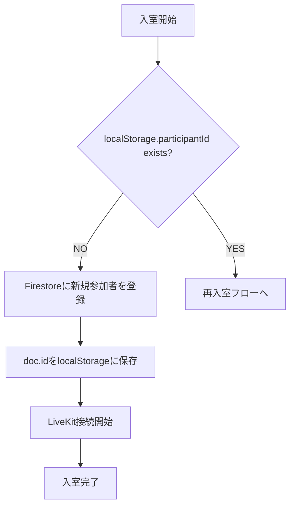
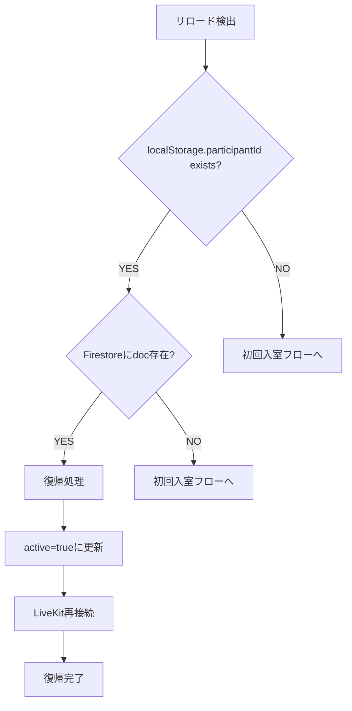
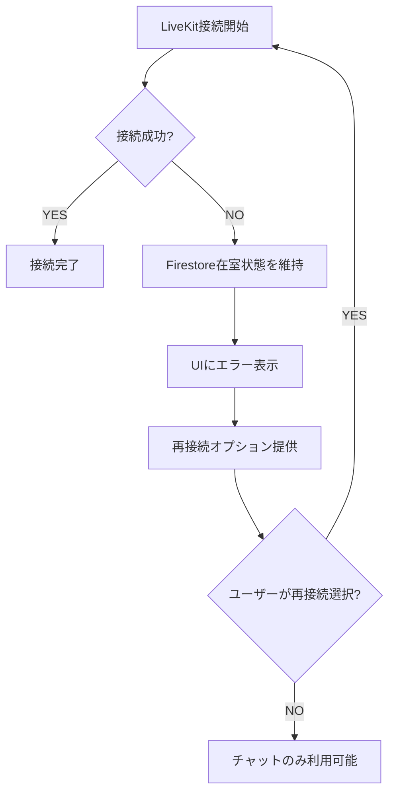
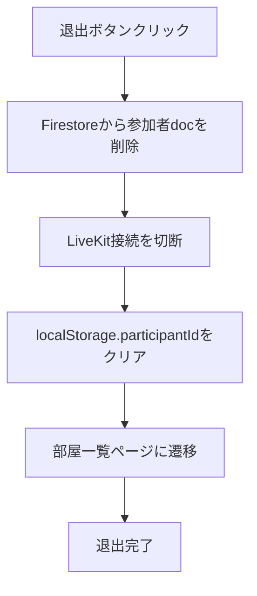
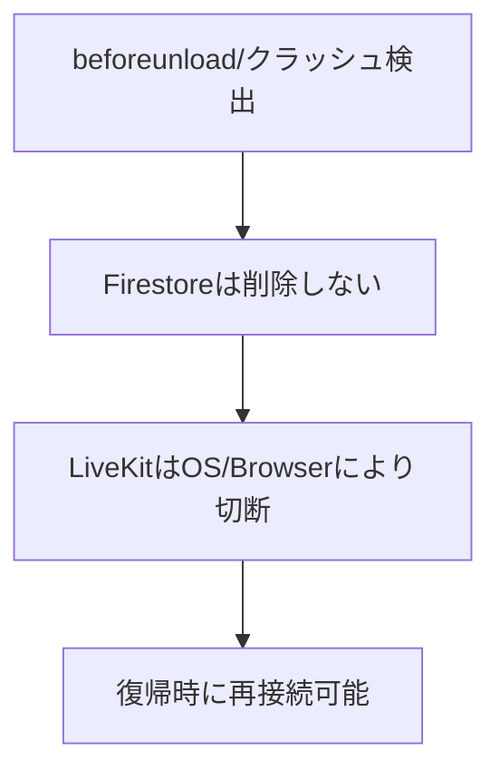

# MOKU 参加者管理仕様書 (Final / Safety-first Ver.)

**作成日:** 2025-01-21  
**目的:** **リロード・競合・重複・整合崩れによる事故を防止するための、参加者管理の唯一の参照仕様**  
**バージョン:** 1.0  
**ステータス:** 実装準備完了

---

## 📋 目次

1. [用語定義](#0-用語定義)
2. [基本方針](#1-基本方針--破綻防止のために従う原則)
3. [イベント別処理フロー](#2-イベント別-処理フロー)
4. [禁止事項](#3-禁止事項)
5. [実装詳細](#4-実装詳細)
6. [エラー処理](#5-エラー処理)
7. [テスト仕様](#6-テスト仕様)
8. [観測対象](#7-今後の観測対象)

---

## 0. 用語定義

| 用語 | 意味 | 備考 |
|------|------|------|
| **Firestore** | 入退室の真実のソース (SSOT) | 参加者の存在を決定する唯一の基準 |
| **LiveKit** | オプショナル機能（映像・音声の付加機能） | Firestore登録後の付随機能 |
| **participant doc** | `/rooms/{roomId}/participants/{participantId}` の1レコード | 参加者の基本情報を格納 |
| **初回入室** | localStorage に participantId が存在しない入室 | 新規参加者の入室処理 |
| **再入室（リロード）** | localStorage に participantId が存在する復帰処理 | 既存参加者の復帰処理 |
| **明示退出** | ユーザーが「退出ボタン」を押した場合の退出 | 唯一の削除トリガ |
| **非明示退出** | タブ閉じ・クラッシュ・強制終了 | Firestore削除を行わない |

---

## 1. 基本方針 (= 破綻防止のために従う原則)

### 1.1 データ整合性の原則
1) **入室の判定は Firestore を唯一の基準とする**  
   └ LiveKit接続は入室ではない、あくまで付随機能

2) **Firestore登録が完了する前に LiveKit接続は開始しない**

3) **リロード・クラッシュ・タブ閉じでは Firestoreは削除しない**  
   └ 破壊的操作は「明示退出時のみ」

### 1.2 参加者識別の原則
4) **参加者の識別は Firestoreの doc.id のみで行う**  
   └ 名前の重複・衝突は気にしない（識別用途に使わない）

### 1.3 安定性優先の原則
5) **整合性崩壊に対する自動復旧機構は現段階では実装しない**  
   └ まず挙動を観測する（過剰制御より安定性を優先）

---

## 2. イベント別 処理フロー

### 2.1 初回入室フロー



#### 実装詳細
```javascript
const handleFirstTimeEntry = async (roomId, userName) => {
  try {
    // 1. Firestore へ新規参加者を登録
    const participantRef = await addDoc(
      collection(getRoomsCollection(), roomId, "participants"),
      {
        name: userName,
        createdAt: serverTimestamp(),
        active: true,
        isHost: false, // ホスト判定は後で行う
        joinedAt: serverTimestamp(),
        lastActivity: serverTimestamp()
      }
    );
    
    // 2. doc.idをlocalStorageに保存
    localStorage.setItem(`participantId_${roomId}`, participantRef.id);
    
    // 3. LiveKit接続開始（Firestore登録成功後）
    await connectToLiveKit(roomId, userName, participantRef.id);
    
    console.log("初回入室完了:", participantRef.id);
    return participantRef.id;
    
  } catch (error) {
    console.error("初回入室エラー:", error);
    throw error;
  }
};
```

### 2.2 リロード/復帰フロー



#### 実装詳細
```javascript
const handleReloadEntry = async (roomId, userName) => {
  try {
    const existingParticipantId = localStorage.getItem(`participantId_${roomId}`);
    
    if (!existingParticipantId) {
      // localStorageにIDがない場合は初回入室扱い
      return await handleFirstTimeEntry(roomId, userName);
    }
    
    // Firestoreで既存参加者の存在を確認
    const participantDoc = await getDoc(
      doc(getRoomsCollection(), roomId, "participants", existingParticipantId)
    );
    
    if (participantDoc.exists()) {
      // 復帰処理
      console.log("復帰処理開始:", existingParticipantId);
      
      // active=trueに更新（必要に応じて）
      await updateDoc(
        doc(getRoomsCollection(), roomId, "participants", existingParticipantId),
        {
          active: true,
          lastActivity: serverTimestamp()
        }
      );
      
      // LiveKit再接続
      await connectToLiveKit(roomId, userName, existingParticipantId);
      
      console.log("復帰完了:", existingParticipantId);
      return existingParticipantId;
      
    } else {
      // docが欠落している例外時のみ新規入室扱い
      console.log("参加者docが欠落、初回入室にフォールバック");
      localStorage.removeItem(`participantId_${roomId}`);
      return await handleFirstTimeEntry(roomId, userName);
    }
    
  } catch (error) {
    console.error("復帰処理エラー:", error);
    throw error;
  }
};
```

### 2.3 LiveKit接続失敗時の処理



#### 実装詳細
```javascript
const handleLiveKitConnectionFailure = async (roomId, participantId) => {
  try {
    // Firestore在室状態は維持
    console.log("LiveKit接続失敗、Firestore在室状態を維持");
    
    // UIにエラー表示
    setConnectionError("映像接続に失敗しました");
    
    // 再接続オプションを提供
    setShowReconnectOption(true);
    
  } catch (error) {
    console.error("LiveKit接続失敗処理エラー:", error);
  }
};

const retryLiveKitConnection = async (roomId, userName, participantId) => {
  try {
    setConnectionError(null);
    setShowReconnectOption(false);
    
    await connectToLiveKit(roomId, userName, participantId);
    
  } catch (error) {
    console.error("LiveKit再接続エラー:", error);
    handleLiveKitConnectionFailure(roomId, participantId);
  }
};
```

### 2.4 明示退出フロー（唯一の削除トリガ）



#### 実装詳細
```javascript
const handleExplicitExit = async (roomId, participantId) => {
  try {
    console.log("明示退出開始:", participantId);
    
    // 1. Firestoreから参加者docを削除
    await deleteDoc(
      doc(getRoomsCollection(), roomId, "participants", participantId)
    );
    
    // 2. LiveKit接続を切断
    await disconnectLiveKit();
    
    // 3. localStorage.participantIdをクリア
    localStorage.removeItem(`participantId_${roomId}`);
    
    // 4. 部屋一覧ページに遷移
    navigate('/');
    
    console.log("明示退出完了");
    
  } catch (error) {
    console.error("明示退出エラー:", error);
    // エラーが発生してもlocalStorageはクリア
    localStorage.removeItem(`participantId_${roomId}`);
    navigate('/');
  }
};
```

### 2.5 タブ閉じ/クラッシュ/強制終了



#### 実装詳細
```javascript
const handleUnexpectedTermination = (roomId, participantId) => {
  // beforeunloadイベントリスナー
  const handleBeforeUnload = (event) => {
    // Firestoreは削除しないことを保証
    console.log("予期しない終了検出、Firestoreは削除しない");
    
    // 必要に応じてlastActivityを更新
    updateDoc(
      doc(getRoomsCollection(), roomId, "participants", participantId),
      { lastActivity: serverTimestamp() }
    ).catch(error => {
      console.error("lastActivity更新エラー:", error);
    });
  };
  
  window.addEventListener('beforeunload', handleBeforeUnload);
  
  return () => {
    window.removeEventListener('beforeunload', handleBeforeUnload);
  };
};
```

---

## 3. 禁止事項

### 3.1 データ操作の禁止事項
- ❌ **「リロード時に delete→再生成する」挙動は禁止**
- ❌ **LiveKit接続を Firestore より先に開始する実装は禁止**
- ❌ **名前を参加者識別キーとして扱う設計は禁止**
- ❌ **整合性エラー時の自動削除・自動クリーンアップは禁止（現段階）**

### 3.2 実装パターンの禁止事項
- ❌ **onSnapshot内での重複削除処理**
- ❌ **useEffectの依存配列での不適切な再実行**
- ❌ **Promise.allでの並列削除処理**
- ❌ **参加者数の即座更新（デバウンスなし）**

---

## 4. 実装詳細

### 4.1 useParticipants.js の修正

```javascript
// 修正後のuseParticipants.js
export const useParticipants = (roomId, userName) => {
  const [participants, setParticipants] = useState([]);
  const [myParticipantId, setMyParticipantId] = useState(null);
  const [participantsLoading, setParticipantsLoading] = useState(true);
  const isUnmountingRef = useRef(false);

  useEffect(() => {
    let participantId = null;
    isUnmountingRef.current = false;

    const joinRoom = async () => {
      try {
        // リロード/復帰処理
        participantId = await handleReloadEntry(roomId, userName);
        
        if (!isUnmountingRef.current) {
          setMyParticipantId(participantId);
        }
        
      } catch (error) {
        console.error("参加者登録エラー:", error);
      }
    };

    joinRoom();

    // 予期しない終了の処理
    const cleanup = handleUnexpectedTermination(roomId, participantId);

    return () => {
      isUnmountingRef.current = true;
      cleanup();
      
      // 明示退出時のみ削除処理
      // リロード時は削除しない
    };
  }, [roomId, userName]);

  // 参加者リストの監視（重複削除なし）
  useEffect(() => {
    const participantsQuery = query(
      collection(getRoomsCollection(), roomId, "participants"),
      orderBy("joinedAt", "asc")
    );

    const unsubscribe = onSnapshot(participantsQuery, (snapshot) => {
      const participants = snapshot.docs.map(doc => ({
        id: doc.id,
        ...doc.data()
      }));

      // アクティブな参加者のみをフィルタリング
      const activeParticipants = participants.filter(participant => 
        participant.active !== false
      );

      setParticipants(activeParticipants);
      setParticipantsLoading(false);
    });

    return unsubscribe;
  }, [roomId]);

  return {
    participants,
    myParticipantId,
    participantsLoading,
    handleExplicitExit: () => handleExplicitExit(roomId, myParticipantId)
  };
};
```

### 4.2 VideoCallRoom.jsx の修正

```javascript
// 修正後のVideoCallRoom.jsx
const VideoCallRoom = ({ roomId, userName, onRoomDisconnected, onLeaveRoom }) => {
  const [room, setRoom] = useState(null);
  const [participants, setParticipants] = useState([]);
  const [connectionError, setConnectionError] = useState(null);
  const [showReconnectOption, setShowReconnectOption] = useState(false);

  useEffect(() => {
    const connectToRoom = async () => {
      try {
        // Firestore登録完了後にLiveKit接続
        const room = new Room();
        
        await room.connect(LIVEKIT_CONFIG.url, token, {
          identity: userName,
          name: userName,
        });

        setRoom(room);
        
        // 参加者イベントの設定
        room.on(RoomEvent.ParticipantConnected, (participant) => {
          setParticipants(prev => [...prev, participant]);
        });

        room.on(RoomEvent.ParticipantDisconnected, (participant) => {
          setParticipants(prev => prev.filter(p => p.identity !== participant.identity));
        });

      } catch (error) {
        console.error("LiveKit接続エラー:", error);
        handleLiveKitConnectionFailure(roomId, participantId);
      }
    };

    connectToRoom();

    return () => {
      if (room) {
        room.disconnect();
      }
    };
  }, []); // 依存配列は空（リロード時の再実行を防ぐ）

  return (
    <div className="video-call-room">
      {connectionError && (
        <div className="connection-error">
          <p>{connectionError}</p>
          {showReconnectOption && (
            <button onClick={() => retryLiveKitConnection(roomId, userName, participantId)}>
              再接続
            </button>
          )}
        </div>
      )}
      
      {/* ビデオ要素の表示 */}
      <div className="participants-grid">
        {participants.map(participant => (
          <video
            key={participant.identity}
            ref={(el) => {
              if (el && participant.videoTrack) {
                participant.videoTrack.attach(el);
              }
            }}
            autoPlay
            playsInline
          />
        ))}
      </div>
    </div>
  );
};
```

---

## 5. エラー処理

### 5.1 エラーレベルの定義

| レベル | 内容 | 処理方法 |
|--------|------|----------|
| **Critical** | Firestore接続失敗 | アプリ全体を停止 |
| **High** | 参加者登録失敗 | エラー表示、リトライ可能 |
| **Medium** | LiveKit接続失敗 | チャットのみ利用可能 |
| **Low** | 参加者数更新失敗 | ログ出力のみ |

### 5.2 エラーハンドリングの実装

```javascript
const handleError = (error, level, context) => {
  const errorInfo = {
    level,
    context,
    error: error.message,
    timestamp: new Date().toISOString(),
    roomId,
    participantId: myParticipantId
  };

  console.error(`[${level}] ${context}:`, errorInfo);

  switch (level) {
    case 'Critical':
      // アプリ全体を停止
      setAppError('システムエラーが発生しました');
      break;
      
    case 'High':
      // エラー表示、リトライ可能
      setConnectionError('接続に失敗しました');
      setShowRetryOption(true);
      break;
      
    case 'Medium':
      // チャットのみ利用可能
      setConnectionError('映像接続に失敗しました');
      setShowReconnectOption(true);
      break;
      
    case 'Low':
      // ログ出力のみ
      console.warn('参加者数更新失敗:', error);
      break;
  }
};
```

---

## 6. テスト仕様

### 6.1 単体テスト

```javascript
// 参加者管理のテスト
describe('Participant Management', () => {
  test('初回入室時にFirestoreに参加者が登録される', async () => {
    const roomId = 'test-room';
    const userName = 'test-user';
    
    await handleFirstTimeEntry(roomId, userName);
    
    const participantDoc = await getDoc(
      doc(getRoomsCollection(), roomId, 'participants', participantId)
    );
    
    expect(participantDoc.exists()).toBe(true);
    expect(participantDoc.data().name).toBe(userName);
  });

  test('リロード時に既存参加者IDが再利用される', async () => {
    const roomId = 'test-room';
    const userName = 'test-user';
    const existingId = 'existing-participant-id';
    
    localStorage.setItem(`participantId_${roomId}`, existingId);
    
    const participantId = await handleReloadEntry(roomId, userName);
    
    expect(participantId).toBe(existingId);
  });

  test('明示退出時にFirestoreから参加者が削除される', async () => {
    const roomId = 'test-room';
    const participantId = 'test-participant';
    
    await handleExplicitExit(roomId, participantId);
    
    const participantDoc = await getDoc(
      doc(getRoomsCollection(), roomId, 'participants', participantId)
    );
    
    expect(participantDoc.exists()).toBe(false);
  });
});
```

### 6.2 統合テスト

```javascript
// 複数ユーザーでのテスト
describe('Multi-user Integration', () => {
  test('複数ユーザーが同時に入室できる', async () => {
    const roomId = 'test-room';
    const users = ['user1', 'user2', 'user3'];
    
    const participantIds = await Promise.all(
      users.map(user => handleFirstTimeEntry(roomId, user))
    );
    
    expect(participantIds).toHaveLength(3);
    expect(new Set(participantIds).size).toBe(3); // 重複なし
  });

  test('リロード時に参加者数が正しく維持される', async () => {
    const roomId = 'test-room';
    const userName = 'test-user';
    
    // 初回入室
    const participantId = await handleFirstTimeEntry(roomId, userName);
    
    // リロード
    const reloadedId = await handleReloadEntry(roomId, userName);
    
    expect(reloadedId).toBe(participantId);
    
    // 参加者数が1のまま維持される
    const participants = await getDocs(
      collection(getRoomsCollection(), roomId, 'participants')
    );
    
    expect(participants.size).toBe(1);
  });
});
```

---

## 7. 今後の観測対象

### 7.1 実装後の検証ポイント

1. **リロード連打時に整合性崩れが再発するか**
   - 連続リロードテストの実施
   - 参加者数の変動監視

2. **Firestoreに無駄レコードが蓄積されても運用上問題が出るか**
   - 残留データの蓄積量監視
   - パフォーマンスへの影響測定

3. **「退出忘れ」による残留データがどの頻度で発生するか**
   - 残留データの発生頻度統計
   - 自動クリーンアップの必要性判断

4. **LiveKit障害時にチャットのみユーザーが実害なく使えるか**
   - LiveKit接続失敗時のユーザー体験
   - チャット機能の独立性確認

### 7.2 監視指標

| 指標 | 目標値 | 監視方法 |
|------|--------|----------|
| 参加者数整合性 | 100% | リアルタイム監視 |
| リロード成功率 | >95% | ログ分析 |
| 残留データ率 | <5% | 日次統計 |
| LiveKit接続成功率 | >90% | エラーログ分析 |

---

## 8. この仕様の目的の再確認

### 8.1 仕様の性質
これは「最終完成形の理想仕様」ではなく、  
**テスト運用段階で壊れないための安全設計仕様**  
である。

### 8.2 実装の優先順位
1. **Phase 1:** 基本フローの実装（初回入室・リロード・明示退出）
2. **Phase 2:** エラーハンドリングの強化
3. **Phase 3:** 監視・ログ機能の追加
4. **Phase 4:** パフォーマンス最適化

### 8.3 成功基準
- リロード時の参加者数不整合が発生しない
- カメラ/マイクの消失が発生しない
- 参加者登録の失敗が発生しない
- 退出時の誤表示が発生しない

---

**この仕様書に基づいて実装を開始しますか？** 🚀
