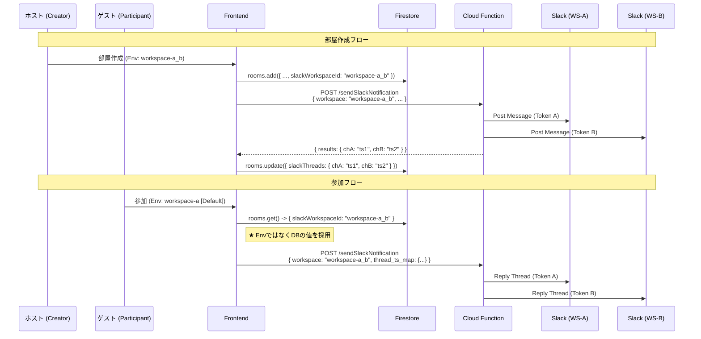

# 複数チャンネル・クロスワークスペース Slack通知機能の実装

**作成日**: 2025-12-24
**更新日**: 2025-12-24
**ステータス**: 完了

## 1. 概要

本ドキュメントでは、Slack通知機能を拡張し、**「単一の部屋作成アクションから、複数のワークスペース（または複数のチャンネル）へ同時に通知を送信する」** 機能の実装詳細について記述します。

特に、参加者がゲスト（自分の環境設定がホストと異なる）場合でも、ホストが意図した通りのチャンネルへ通知が届くようにするための **「ワークスペースIDの永続化」** 対応についても触れます。

## 2. 背景と課題

### 2.1. 初期実装の限界
当初の設計では、フロントエンドの環境変数 (`VITE_SLACK_ACTIVE_WORKSPACE`) に依存して通知先を決定していました。
しかし、これには以下の問題がありました：

1.  **複数チャンネルへの同時送信不可**: 1つのワークスペース設定につき、1つのチャンネルIDしか紐付けられなかった。
2.  **クロスワークスペースの壁**: 「Workspace A の Channel 1」と「Workspace B の Channel 2」に同時に送りたい場合、それぞれの Bot Token を使い分ける仕組みがなかった。
3.  **ゲスト参加時の不整合**: 参加者（ゲスト）が通知を送る際、ゲスト自身の環境変数が使われてしまい、ホストが設定した通知先（例: `workspace-a_b`）ではなく、ゲストのデフォルト（例: `workspace-a`）に送信されてしまうバグが発生した。

## 3. アーキテクチャ変更点

### 3.1. Cloud Functions (`functions/slack/notify.js`)

**Bot Token と通知ルートの分離**

以前は `WORKSPACE_CONFIGS` という配列で「ID, Token, Channel」を1セットにしていました。
これを **「Token定義 (`SECRETS`)」** と **「通知ルート定義 (`NOTIFICATION_ROUTES`)」** に分離しました。

```javascript
// 1. Token定義 (Secret Manager連携)
const SECRETS = {
  A: defineSecret("SLACK_BOT_TOKEN_A"),
  B: defineSecret("SLACK_BOT_TOKEN_B"),
  // ...
};

// 2. 通知ルート定義 (1つのキーに対し、複数の宛先を設定可能)
const NOTIFICATION_ROUTES = {
  // 単一宛先
  "workspace-a": [ { secret: SECRETS.A, channelId: "Cxxxx" } ],
  
  // ★ クロスワークスペース一斉送信設定
  "workspace-a_b": [
    { secret: SECRETS.A, channelId: "Cxxxx" }, // Token A 使用
    { secret: SECRETS.B, channelId: "Cyyyy" }  // Token B 使用
  ]
};
```

これにより、フロントエンドから `workspace: "workspace-a_b"` を指定するだけで、サーバー側で適切なTokenを使い分けて複数箇所に送信できるようになりました。

### 3.2. データモデル (Firestore)

**`rooms` コレクションへのフィールド追加**

| フィールド名 | 型 | 説明 |
| :--- | :--- | :--- |
| `slackThreads` | `Map<string, string>` | `channelId` をキー、`thread_ts` を値とするマップ。複数チャンネルのスレッドIDを管理するために追加。 |
| `slackWorkspaceId` | `string` | **重要**。部屋作成時に使用されたワークスペースID（通知ルートID）を保存。 |

### 3.3. フロントエンドロジック

**通知ルートの永続化と利用**

ゲスト参加時の不整合を防ぐため、以下のフローに変更しました。

1.  **部屋作成時 (`useRoomCreation.js`)**:
    *   環境変数 `SLACK_CONFIG.activeWorkspace` の値を、部屋データの `slackWorkspaceId` としてFirestoreに保存。
    *   同時に、Slack API へもこのIDを渡して通知を実行。

2.  **参加時 (`RoomPage.jsx` -> `useSlackNotification.js`)**:
    *   環境変数は**参照せず**、Firestoreから取得した `room.slackWorkspaceId` を使用する。
    *   これを `notifyParticipantJoined` に渡し、APIリクエストの `workspace` パラメータとして送信。

## 4. シーケンス図（修正後）



## 5. 検証結果

*   **単一送信**: 正常動作確認済み。
*   **複数送信 (Token A & B)**: 正常動作確認済み。
*   **ゲスト参加 (Env不一致)**: `slackWorkspaceId` の永続化により、ゲスト環境でも正しいルート（A & B）へ通知されることを確認済み。

## 6. 今後の検討事項

*   現在、`NOTIFICATION_ROUTES` はコードにハードコーディングされています。将来的に動的な設定が必要になった場合は、Firestoreの `system_configs` コレクションなどで管理することを検討してください。
